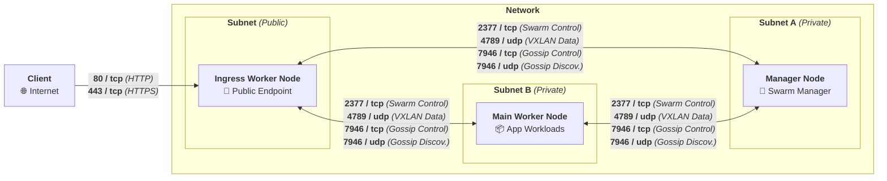

[](LICENSE) []() []()

# **[Cloud Skeleton][cloud-skeleton]** ► **[Prerequisites][prerequisites]**

## Overview

The **[Prerequisites][prerequisites]** repository provides a unified, interactive setup script that prepares supported **Linux distributions** for use within the **[Cloud Skeleton][cloud-skeleton]** infrastructure via OS-specific scripts.

It is designed to be safe, modular, and self-documenting — perfect for bare-metal servers, cloud VMs, or homelab deployments.

## Usage

To set up a resilient and secure infrastructure, you must provision **at least 3 nodes**:

1. 🧐 **Manager Node** – Orchestrates the **[Docker Swarm][docker-swarm]** cluster.  
2. 🧱 **Main Worker Node** – Runs core application workloads.  
3. 🌐 **Ingress Worker Node** – Handles **external access**, such as hosting **[Traefik][traefik]** or a similar reverse proxy.



---

### 1. **Prepare Your Environment**

Install **[Git][git]** and **[Git LFS][git-lfs]**, then clone the **[Cloud Skeleton][cloud-skeleton]** ► **[Prerequisites][prerequisites]** repository:

```sh
sudo apt update
sudo apt install -y git git-lfs
git clone https://github.com/cloud-skeleton/prerequisites.git /tmp/cloud-skeleton-prerequisites
cd /tmp/cloud-skeleton-prerequisites
```

Install and configure **[uv][uv]** for **[Cloud Skeleton][cloud-skeleton]** ► **[Prerequisites][prerequisites]** dependencies management:

```sh
wget -qO- https://astral.sh/uv/install.sh | sh
export UV_LINK_MODE=copy
export UV_ENV_FILE=.env
```

### 2. **Configure The Scripts**

Create `.env` file with the following content:

```sh
NODE_INGRESS_WORKERS="ingress-worker-1.cluster.${DOMAIN}"
NODE_INGRESS_WORKERS_NAMESERVERS="9.9.9.9 149.112.112.112"
NODE_MAIN_WORKERS="main-worker-1.cluster.${DOMAIN}"
NODE_MAIN_WORKERS_NAMESERVERS="9.9.9.9 149.112.112.112"
NODE_MANAGERS="manager-1.cluster.${DOMAIN}"
NODE_MANAGERS_NAMESERVERS="9.9.9.9 149.112.112.112"
SSH_KEY_FILE_PATH=~/.ssh/id_rsa
SSH_USER=root
SSH_ALLOW_IP_CIDRS="192.168.0.0/16 172.16.0.0/12 10.0.0.0/8"
```

### 3. **Prepare Nodes For [SSH][ssh] connections**

On **each node** log in as **root** and create *ansible* user:

```sh
adduser ansible
cat > /etc/sudoers.d/ansible << EOF
ansible ALL=(ALL) NOPASSWD: ALL
EOF
```

Upload your **[SSH][ssh]** key file to all nodes:

```sh
. .config.env
for NODE_INGRESS_WORKER in ${NODE_INGRESS_WORKERS}; do
  ssh-copy-id -i "${SSH_KEY_FILE_PATH}.pub" "${SSH_USER}@${NODE_INGRESS_WORKER}"
done
for NODE_MAIN_WORKER in ${NODE_MAIN_WORKERS}; do
  ssh-copy-id -i "${SSH_KEY_FILE_PATH}.pub" "${SSH_USER}@${NODE_MAIN_WORKER}"
done
for NODE_MANAGER in ${NODE_MANAGERS}; do
  ssh-copy-id -i "${SSH_KEY_FILE_PATH}.pub" "${SSH_USER}@${NODE_MANAGER}"
done
```

### 4. **Install Dependencies**

Install [Ansible][ansible] plugins:

```sh
uv run ansible-galaxy collection install -Ur requirements.yml
```

### 5. **Deploy All Prerequisites**

```sh
uv run ansible all -m ping
uv run ansible-playbook playbooks/main.yml --diff
```

<!-- On **each node**, log in as **root**, install **[Git][git]**, **[Git LFS][git-lfs]**, and **[Curl][curl]**, then clone the prerequisites repository:

```sh
apt update
apt install -y git git-lfs curl
git clone https://github.com/cloud-skeleton/prerequisites.git /tmp/cloud-skeleton-prerequisites
```

---

### 2. **Run the Installation Script**

Execute the `./install.sh` script as **root**:

```sh
cd /tmp/cloud-skeleton-prerequisites
./install.sh
```

The script will interactively prompt you for:

- **USER_NAME**: The new username to be created (or *blank* if using current user).
- **USER_PASSWORD**: The password for the new user.
- **SSH_ALLOW_IP_CIDRS**: Space-separated CIDRs (e.g., `10.0.0.0/8 172.16.0.0/12 192.168.0.0/16`) allowed to access **[SSH][ssh]** (used for firewall configuration).
- **IS_MANAGER**: `y/n` to determine whether the current instance should be configured as a **[Docker Swarm][docker-swarm]** cluster manager.
- **SWARM_CLUSTER_JOIN_TOKEN**: The cluster join token from an existing **[Docker Swarm][docker-swarm]** manager (or leave *blank* to initialize a new cluster).
- **SWARM_NODE_MANAGER_IP**: IP address of any available **[Docker Swarm][docker-swarm]** manager (for joining the cluster).
- **SWARM_NODE_IP_CIDRS**: Space-separated CIDRs of other **[Docker Swarm][docker-swarm]** nodes (used for internal firewall rules).

---

Once the inputs are provided, the script will:

- Configure system packages and security settings,  
- Create the user (if specified),  
- Apply necessary firewall rules,  
- Initialize or join the **[Docker Swarm][docker-swarm]** cluster,  
- And **automatically reboot** the system.

Repeat this process on each of your 3+ nodes to form a fully functional, production-grade cluster.

---

### 3. **Label Your Nodes**

After all nodes have joined the **[Docker Swarm][docker-swarm]** cluster, log in to your **manager node** and assign node roles using **[Docker][docker]** node labels.

> ⚠️ Be sure to replace the example hostnames below (`${DOCKER_SWARM_MANAGER}`, etc.) with the **actual hostnames of your nodes**. You can view them using `docker node ls`.

```sh
docker node update --label-add type=manager ${DOCKER_SWARM_MANAGER}
docker node update --label-add type=worker.main ${DOCKER_SWARM_WORKER_MAIN}
docker node update --label-add type=worker.ingress ${DOCKER_SWARM_WORKER_INGRESS}
```

These labels can then be used to control service placement via `placement.constraints` in your **[Docker][docker]** stack files.

---

### 4. **Configure Persistent Volume ([NFS][nfs]-based)**

To enable **shared, persistent storage** across your **[Docker Swarm][docker-swarm]** cluster, configure an **external [NFS][nfs] volume** that can be mounted by services on any node.

You must have an accessible **[NFS][nfs]** server (e.g., a NAS or dedicated data node) exporting a directory for use by the cluster.

> 🛠️ Don't have an **[NFS][nfs]** server?
>
> If you don’t yet have a persistent storage server, see the dedicated repository:  
> 👉 **[Cloud Skeleton][cloud-skeleton]** ► **[Data Storage][data-storage]**. It contains installation scripts and instructions for setting up a highly available **[NFS][nfs]** storage server that can be mounted from any node in your cluster.

#### 🟩 Example: Create a shared **[NFS][nfs]** volume

On any **[Docker Swarm][docker-swarm]** node, run the following (replacing the address and path with your setup):

```sh
docker volume create \
  --driver local \
  --opt type=nfs \
  --opt o=addr=${NFS_SERVER_IP},rw \
  --opt device=:/srv/data/cloud-skeleton \
  storage
```

This will create a volume named `storage` that services in your stack can mount like this:

```yaml
volumes:
  - storage:/data/my-service
```

And in the `volumes` section of your `docker-compose.yml` or `stack.yml`:

```yaml
volumes:
  storage:
    external: true
``` -->

---

## Contributing

Contributions and improvements to this installation script are welcome!  
- Fork the repository.  
- Create a new branch (e.g., **`feature/my-improvement`**).  
- Submit a pull request with your changes.

## License

This project is licensed under the [GNU General Public License v3.0](LICENSE).

---

*This repository is maintained exclusively by the **[Cloud Skeleton][cloud-skeleton]** project, and it was developed by EU citizens who are strong proponents of the European Federation. 🇪🇺*

<!-- Reference -->
[ansible]: https://docs.ansible.com/ansible/latest/getting_started/index.html
[cloud-skeleton]: https://github.com/cloud-skeleton/  
[curl]: https://everything.curl.dev/  
[data-storage]: https://github.com/cloud-skeleton/data-storage  
[docker]: https://docs.docker.com/get-started/  
[docker-compose]: https://docs.docker.com/compose/gettingstarted/  
[docker-swarm]: https://docs.docker.com/engine/swarm/  
[git]: https://git-scm.com/book/ms/v2/Getting-Started-First-Time-Git-Setup  
[git-lfs]: https://github.com/git-lfs/git-lfs/wiki/Tutorial  
[nfs]: https://www.techtarget.com/searchenterprisedesktop/definition/Network-File-System  
[prerequisites]: https://github.com/cloud-skeleton/prerequisites/  
[ssh]: https://www.openssh.com/manual.html  
[traefik]: https://doc.traefik.io/traefik/
[uv]: https://docs.astral.sh/uv/getting-started/
