[](LICENSE) []() []()

# **[Cloud Skeleton][cloud-skeleton]** ► **[Prerequisites][prerequisites]**

## Overview

The **[Prerequisites][prerequisites]** repository provides a unified, interactive setup script that prepares supported **Linux distributions** for use within the **[Cloud Skeleton][cloud-skeleton]** infrastructure via OS-specific scripts.

It is designed to be safe, modular, and self-documenting — perfect for bare-metal servers, cloud VMs, or homelab deployments.

## Usage

To set up a resilient and secure infrastructure, you must provision **at least 3 nodes**:

1. 🧐 **Manager Node** – Orchestrates the **[Docker Swarm][docker-swarm]** cluster.  
2. 🧱 **Main Worker Node** – Runs core application workloads.  
3. 🌐 **Ingress Worker Node** – Handles **external access**, such as hosting **[Traefik][traefik]** or a similar reverse proxy.

```mermaid
graph LR

  external_client["<b>Client</b><br>🌐 Internet"]

  subgraph "<b>Network</b>"
    subgraph "<b>Subnet</b> <i>(Public)</i>"
      ingress["<b>Ingress Worker Node</b><br>🚪 Public Endpoint"]
    end

    subgraph "<b>Subnet A</b> <i>(Private)</i>"
      manager["<b>Manager Node</b><br>🧐 Swarm Manager"]
    end

    subgraph "<b>Subnet B</b> <i>(Private)</i>"
      worker["<b>Main Worker Node</b><br>📦 App Workloads"]
    end
  end

  external_client -->|"<b>80 / tcp</b> <i>(HTTP)</i><br><b>443 / tcp</b> <i>(HTTPS)</i>"| ingress

  ingress <-->|"<b>4789 / udp</b> <i>(VXLAN Data)</i><br><b>7946 / tcp</b> <i>(Gossip Control)</i><br><b>7946 / udp</b> <i>(Gossip Discov.)</i>"| worker

  ingress <-->|"<b>2377 / tcp</b> <i>(Swarm Control)</i><br><b>4789 / udp</b> <i>(VXLAN Data)</i><br><b>7946 / tcp</b> <i>(Gossip Control)</i><br><b>7946 / udp</b> <i>(Gossip Discov.)</i>"| manager

  worker <-->|"<b>2377 / tcp</b> <i>(Swarm Control)</i><br><b>4789 / udp</b> <i>(VXLAN Data)</i><br><b>7946 / tcp</b> <i>(Gossip Control)</i><br><b>7946 / udp</b> <i>(Gossip Discov.)</i>"| manager
```



---

### 1. Prepare Your Environment

- Install **[Git][git]** and **[Git LFS][git-lfs]**, then clone the **[Cloud Skeleton][cloud-skeleton]** ► **[Prerequisites][prerequisites]** repository:

  ```sh
  sudo apt update
  sudo apt install -y git git-lfs
  git clone https://github.com/cloud-skeleton/prerequisites.git /tmp/cloud-skeleton-prerequisites
  cd /tmp/cloud-skeleton-prerequisites
  ```

- Install and configure **[uv][uv]**:

  ```sh
  wget -qO- https://astral.sh/uv/install.sh | sh
  export UV_LINK_MODE=copy
  export UV_ENV_FILE=.env
  ```

### 2. Configure the Scripts

- Create a file named `.csi.yml` in `/tmp/cloud-skeleton-prerequisites`; **[Ansible][ansible]** will then deploy it as `/etc/democratic-csi.yml` on each **[Docker Swarm][docker-swarm]** node. This file contains the **[Democratic CSI][democratic-csi]** plugin configuration used for your persistent volumes in the **[Docker Swarm][docker-swarm]** cluster.

  Example for Synology devices behind reverse proxy:

  ```yaml
  driver: synology-iscsi

  httpConnection:
    host: <HOSTNAME>
    password: <PASSWORD>
    port: 443
    protocol: https
    serialize: true
    session: democratic-csi
    username: <USERNAME>

  iscsi:
    baseiqn: iqn.2025-07.<REVERSE DOMAIN>:democratic-csi.
    lunSnapshotTemplate:
      is_app_consistent: true
      is_locked: true
    lunTemplate:
      type: BLUN
    targetPortal: <HOSTNAME>
    targetTemplate:
      auth_type: 0
      max_sessions: 0
  ```

  **Placeholder explanations:**
  - `<HOSTNAME>`: the fully qualified domain name or IP address of your Synology NAS (e.g. `nas.domain.com`).  
  - `<USERNAME>`: the DSM user account (with Storage Manager API privileges) that the CSI driver will authenticate as.  
  - `<PASSWORD>`: the password for the above DSM user.  
  - `<REVERSE DOMAIN>`: your NAS’s domain in reverse order (e.g. for `domain.com`, use `com.domain`).  

- Create a file named `.env` in `/tmp/cloud-skeleton-prerequisites` folder with the following content:

  ```bash
  # Ingress worker node hostnames (space-separated list)
  NODE_INGRESS_WORKERS="ingress-worker-1.cluster.${DOMAIN}"

  # DNS nameservers for ingress workers (space-separated list)
  NODE_INGRESS_WORKERS_NAMESERVERS="9.9.9.9 149.112.112.112"

  # Main worker node hostnames (space-separated list)
  NODE_MAIN_WORKERS="main-worker-1.cluster.${DOMAIN}"

  # DNS nameservers for main workers (space-separated list)
  NODE_MAIN_WORKERS_NAMESERVERS="9.9.9.9 149.112.112.112"

  # Manager node hostnames (space-separated list)
  NODE_MANAGERS="manager-1.cluster.${DOMAIN}"

  # DNS nameservers for managers (space-separated list)
  NODE_MANAGERS_NAMESERVERS="9.9.9.9 149.112.112.112"

  # SSH private key path (single value)
  SSH_KEY_FILE_PATH=~/.ssh/id_rsa

  # SSH user to connect as (single value)
  SSH_USER=root

  # CIDR ranges allowed to connect via SSH (space-separated list)
  SSH_ALLOW_IP_CIDRS="192.168.0.0/16 172.16.0.0/12 10.0.0.0/8"
  ```

  #### Variable Descriptions

  - **`NODE_INGRESS_WORKERS`**  
    A space-separated list of ingress-worker hostnames that **[Ansible][ansible]** will target for your public entry point nodes.

  - **`NODE_INGRESS_WORKERS_NAMESERVERS`**  
    DNS servers to configure on each ingress-worker. Specifies where these nodes should forward DNS queries.

  - **`NODE_MAIN_WORKERS`**  
    A space-separated list of your application-worker hostnames. These nodes handle the main workload behind your ingress layer.

  - **`NODE_MAIN_WORKERS_NAMESERVERS`**  
    DNS servers to configure on each main-worker node.

  - **`NODE_MANAGERS`**  
    A space-separated list of manager hostnames. These nodes run the **[Docker Swarm][docker-swarm]** manager services.

  - **`NODE_MANAGERS_NAMESERVERS`**  
    DNS servers to configure on each manager node.

  - **`SSH_KEY_FILE_PATH`**  
    Path (absolute or relative) to the **[SSH][ssh]** private key file used by **[Ansible][ansible]** to connect to all nodes.

  - **`SSH_USER`**  
    The username **[Ansible][ansible]** should use when **[SSH-ing][ssh]** into each host (e.g. `root` or a dedicated `ansible` user).

  - **`SSH_ALLOW_IP_CIDRS`**  
    A space-separated list of CIDR blocks that UFW will whitelist for **[SSH][ssh]** (TCP port 22) access.

  > **Note:** Whenever you see a variable in double quotes containing multiple values (e.g. `"a b c"`), it will be parsed as a list of strings split on spaces. Variables without quotes (e.g. `SSH_USER=root`) are treated as single values.  

### 3. Prepare Nodes For **[SSH][ssh]** Connections

Before running any **[Ansible][ansible]** playbooks, you need an unprivileged user with password-less sudo and your **[SSH][ssh]** key installed on each host.

```bash
# 1. Create the 'ansible' user on each node (run as root):
adduser ansible
cat > /etc/sudoers.d/ansible << EOF
ansible ALL=(ALL) NOPASSWD: ALL
EOF

# 2. Upload your SSH public key to all nodes:
#    This will read NODE_INGRESS_WORKERS, NODE_MAIN_WORKERS and NODE_MANAGERS
#    from .env and copy the key to each host.
source .env

for NODE in ${NODE_INGRESS_WORKERS} ${NODE_MAIN_WORKERS} ${NODE_MANAGERS}; do
  ssh-copy-id -i "${SSH_KEY_FILE_PATH}.pub" "${SSH_USER}@${NODE}"
done
```

#### What’s happening here

1. **`adduser`**  
   - Creates a new user **`ansible`** with no password.  
   - You’ll **[SSH][ssh]** in as this user (not `root`).

2. **Password-less sudo**  
   - The file `/etc/sudoers.d/ansible` grants **`ansible`** the ability to run **any** command as root without being prompted for a password.  

3. **`ssh-copy-id` loop**  
   - Sources your `.env` so `$NODE_*` variables are available.  
   - Iterates over **all** ingress, main-worker, and manager hosts.  
   - Installs your **public** key (`${SSH_KEY_FILE_PATH}.pub`) into each user’s `~/.ssh/authorized_keys`.

> **Note:**  
> - You only need to run step 1 once per node.  
> - Step 2 can be run from your control machine—make sure you can reach each host via the `${SSH_USER}` account.  
> - If you ever rotate your **[SSH][ssh]** key, re-run the loop in step 2 to update all nodes.  

### 4. Install **[Ansible][ansible]** Collections & Roles

Fetch and install all of the collections and roles your playbooks depend on, as listed in **`requirements.yml`**:

```bash
# Use your uv alias to run ansible-galaxy from the project root
uv run ansible-galaxy collection install -Ur requirements.yml
```

- `-U` (or `--upgrade`) will update any already-installed collections to the versions specified in `requirements.yml`.  
- `-r requirements.yml` tells **[Ansible][ansible]** to read the list of collections (and/or roles) from that file.  
- This ensures everyone working on the project has the same plugin versions.

---

### 5. Verify Connectivity & Deploy Prerequisites

#### 5.1 Test **[SSH][ssh]** access

Make sure **[Ansible][ansible]** can reach **all** of your hosts over **[SSH][ssh]** using the `ping` module:

```bash
uv run ansible all -m ping
```

- This will return `pong` from each reachable node.  
- If any host fails, fix your **[SSH][ssh]** keys or inventory before proceeding.

#### 5.2 Apply the playbook

Once connectivity is confirmed, run your main playbook to configure all prerequisites:

```bash
uv run ansible-playbook playbooks/main.yml --diff
```

> **Tip:**  
> - You can add `--check` to perform a dry-run without making changes:
>   ```bash
>   uv run ansible-playbook playbooks/main.yml --check --diff
>   ```  
> - If you need extra debugging information, include one or more `-v` flags (`-vvv` for maximum verbosity).

<!-- 

---

### 4. **Configure Persistent Volume ([NFS][nfs]-based)**

To enable **shared, persistent storage** across your **[Docker Swarm][docker-swarm]** cluster, configure an **external [NFS][nfs] volume** that can be mounted by services on any node.

You must have an accessible **[NFS][nfs]** server (e.g., a NAS or dedicated data node) exporting a directory for use by the cluster.

> 🛠️ Don't have an **[NFS][nfs]** server?
>
> If you don’t yet have a persistent storage server, see the dedicated repository:  
> 👉 **[Cloud Skeleton][cloud-skeleton]** ► **[Data Storage][data-storage]**. It contains installation scripts and instructions for setting up a highly available **[NFS][nfs]** storage server that can be mounted from any node in your cluster.

#### 🟩 Example: Create a shared **[NFS][nfs]** volume

On any **[Docker Swarm][docker-swarm]** node, run the following (replacing the address and path with your setup):

```sh
docker volume create \
  --driver local \
  --opt type=nfs \
  --opt o=addr=${NFS_SERVER_IP},rw \
  --opt device=:/srv/data/cloud-skeleton \
  storage
```

This will create a volume named `storage` that services in your stack can mount like this:

```yaml
volumes:
  - storage:/data/my-service
```

And in the `volumes` section of your `docker-compose.yml` or `stack.yml`:

```yaml
volumes:
  storage:
    external: true
``` -->

---

## Contributing

Contributions and improvements to this installation script are welcome!  
- Fork the repository.  
- Create a new branch (e.g., **`feature/my-improvement`**).  
- Submit a pull request with your changes.

## License

This project is licensed under the [GNU General Public License v3.0](LICENSE).

---

*This repository is maintained exclusively by the **[Cloud Skeleton][cloud-skeleton]** project, and it was developed by EU citizens who are strong proponents of the European Federation. 🇪🇺*

<!-- Reference -->
[ansible]: https://docs.ansible.com/ansible/latest/getting_started/index.html
[cloud-skeleton]: https://github.com/cloud-skeleton/  
[curl]: https://everything.curl.dev/  
[democratic-csi]: https://github.com/democratic-csi/democratic-csi/tree/master/examples
[docker]: https://docs.docker.com/get-started/  
[docker-compose]: https://docs.docker.com/compose/gettingstarted/  
[docker-swarm]: https://docs.docker.com/engine/swarm/  
[git]: https://git-scm.com/book/ms/v2/Getting-Started-First-Time-Git-Setup  
[git-lfs]: https://github.com/git-lfs/git-lfs/wiki/Tutorial  
[nfs]: https://www.techtarget.com/searchenterprisedesktop/definition/Network-File-System  
[prerequisites]: https://github.com/cloud-skeleton/prerequisites/  
[ssh]: https://www.openssh.com/manual.html  
[traefik]: https://doc.traefik.io/traefik/
[uv]: https://docs.astral.sh/uv/getting-started/
