[](LICENSE)
[]()
[]()

# **[Cloud Skeleton](https://github.com/cloud-skeleton/)** ► **[Prerequisites](https://github.com/cloud-skeleton/prerequisites/)**

> This repository provides the installation script and instructions needed to prepare a **[Debian](https://www.debian.org/releases/bookworm/installmanual)** system for the **[Cloud Skeleton](https://github.com/cloud-skeleton/)** ecosystem. It ensures that all required system components, user configurations, firewall rules, and **[Docker](https://docs.docker.com/get-started/)** setups (including **[Docker Compose](https://docs.docker.com/compose/gettingstarted/)**) are in place before deploying any **[Cloud Skeleton](https://github.com/cloud-skeleton/)** services.

## Overview

The **[Prerequisites](https://github.com/cloud-skeleton/prerequisites/)** project includes a unified installation script (**install.sh**) that performs the following tasks:

- **Validate Operating System:**  
  The script checks the system's `/etc/os-release` to determine the current OS and version, then constructs a path to an OS-specific script (e.g., `os/debian/12.sh`) and executes it. If no supported script is found, the installation aborts.

- **Interactive Environment Variable Prompt:**  
  It interactively asks the user to enter the required variables—**USER_NAME**, **USER_PASSWORD**, and **SSH_ALLOW_IP_CIDR**—and ensures that they are non-empty.

- **Run OS-Specific Installation:**  
  The OS-specific script (for Debian 12, located at `os/debian/12.sh`) performs the following tasks:
  - Updates and upgrades system packages.
  - Applies a workaround for stuck **[SSH](https://www.openssh.com/manual.html)** connections by modifying PAM session settings and restarting the **[SSH](https://www.openssh.com/manual.html)** daemon if necessary.
  - Installs and configures **[UFW](https://help.ubuntu.com/community/UFW)** to allow **[SSH](https://www.openssh.com/manual.html)** only from the specified CIDR range.
  - Creates a new user with the provided credentials and grants that user sudo privileges.
  - Installs **[Docker](https://docs.docker.com/get-started/)** and related packages, configures **[Docker’s](https://docs.docker.com/get-started/)** integration with **[UFW](https://help.ubuntu.com/community/UFW)** by appending necessary rules, and reloads the firewall.
  - Reboots the system automatically after all setup tasks are complete.

## Usage

To set up a resilient and secure infrastructure, you must provision **at least 3 nodes**:

1. 🧠 **Manager Node** – Orchestrates the **[Docker Swarm](https://docs.docker.com/engine/swarm/)** cluster.  
2. 🧱 **Main Worker Node** – Runs core application workloads.  
3. 🌐 **Ingress Worker Node** – Handles **external access**, such as hosting **[Traefik](https://doc.traefik.io/traefik/)** or a similar reverse proxy.

```mermaid
graph LR

  external_client["<b>Client</b><br>🌐 Internet"]

  subgraph "<b>Network</b>"

    subgraph "<b>Subnet</b> <sub style='color:seagreen'><i>(Public)</i></sub>"
      ingress["<b>Ingress Worker Node</b><br>🚪 Public Endpoint"]
    end

    subgraph "<b>Subnet A</b> <sub style='color:orangered'><i>(Private)</i>"
      manager["<b>Manager Node</b><br>🧠 Swarm Manager"]
    end

    subgraph "<b>Subnet B</b> <sub style='color:orangered'><i>(Private)</i>"
      worker["<b>Main Worker Node</b><br>📦 App Workloads"]
    end

  end

  %% External access
  external_client -->|"80 / tcp (HTTP)<br>443 / tcp (HTTPS)"| ingress

  %% Overlay network (VXLAN)
  ingress <-->|"4789 / udp (VXLAN Data)"| worker
  ingress <-->|"4789 / udp (VXLAN Data)"| manager
  worker <-->|"4789 / udp (VXLAN Data)"| manager

  %% Swarm management (one-way)
  manager -->|"2377 / tcp (Swarm Control)"| ingress
  manager -->|"2377 / tcp (Swarm Control)"| worker

  %% Gossip - TCP
  ingress <-->|"7946 / tcp (Gossip Control)"| manager
  worker <-->|"7946 / tcp (Gossip Control)"| manager
  worker <-->|"7946 / tcp (Gossip Control)"| ingress

  %% Gossip - UDP
  ingress <-->|"7946 / udp (Gossip Discov.)"| manager
  worker <-->|"7946 / udp (Gossip Discov.)"| manager
  worker <-->|"7946 / udp (Gossip Discov.)"| ingress
```



---

### 1. **Prepare Your Environment**

On **each node**, log in as **root**, install **[Git](https://git-scm.com/book/ms/v2/Getting-Started-First-Time-Git-Setup)**, **[Git LFS](https://github.com/git-lfs/git-lfs/wiki/Tutorial)**, and **[Curl](https://everything.curl.dev/)**, then clone the prerequisites repository:

```sh
apt update
apt install -y git git-lfs curl
git clone https://github.com/cloud-skeleton/prerequisites.git /tmp/cloud-skeleton-prerequisites
```

---

### 2. **Run the Installation Script**

Execute the `./install.sh` script as **root**:

```sh
cd /tmp/cloud-skeleton-prerequisites
./install.sh
```

The script will interactively prompt you for:

- **USER_NAME**: The new username to be created (or *blank* if using current user).
- **USER_PASSWORD**: The password for the new user.
- **SSH_ALLOW_IP_CIDRS**: Space-separated CIDRs (e.g., `10.0.0.0/8 172.16.0.0/12 192.168.0.0/16`) allowed to access **[SSH](https://www.openssh.com/manual.html)** (used for firewall configuration).
- **IS_MANAGER**: `y/n` to determine whether the current instance should be configured as a **[Docker Swarm](https://docs.docker.com/engine/swarm/)** cluster manager.
- **SWARM_CLUSTER_JOIN_TOKEN**: The cluster join token from an existing **[Docker Swarm](https://docs.docker.com/engine/swarm/)** manager (or leave *blank* to initialize a new cluster).
- **SWARM_NODE_MANAGER_IP**: IP address of any available **[Docker Swarm](https://docs.docker.com/engine/swarm/)** manager (for joining the cluster).
- **SWARM_NODE_IP_CIDRS**: Space-separated CIDRs of other **[Docker Swarm](https://docs.docker.com/engine/swarm/)** nodes (used for internal firewall rules).

---

Once the inputs are provided, the script will:

- Configure system packages and security settings,
- Create the user (if specified),
- Apply necessary firewall rules,
- Initialize or join the **[Docker Swarm](https://docs.docker.com/engine/swarm/)** cluster,
- And **automatically reboot** the system.

Repeat this process on each of your 3+ nodes to form a fully functional, production-grade cluster.

---

### 3. **Label Your Nodes**

After all nodes have joined the **[Docker Swarm](https://docs.docker.com/engine/swarm/)** cluster, log in to your **manager node** and assign node roles using **[Docker](https://docs.docker.com/get-started/)** node labels.

> ⚠️ Be sure to replace the example hostnames below (`${DOCKER_SWARM_MANAGER}`, etc.) with the **actual hostnames of your nodes**. You can view them using `docker node ls`.

```sh
docker node update --label-add type=manager ${DOCKER_SWARM_MANAGER}
docker node update --label-add type=main ${DOCKER_SWARM_WORKER_MAIN}
docker node update --label-add type=ingress ${DOCKER_SWARM_WORKER_INGRESS}
```

These labels can then be used to control service placement via `placement.constraints` in your **[Docker](https://docs.docker.com/get-started/)** stack files.

## Contributing

Contributions and improvements to this installation script are welcome!  
- Fork the repository.
- Create a new branch (e.g., **`feature/my-improvement`**).
- Submit a pull request with your changes.

## License

This project is licensed under the [GNU General Public License v3.0](LICENSE).

---

*This repository is maintained exclusively by the **[Cloud Skeleton](https://github.com/cloud-skeleton/)** project, and it was developed by EU citizens who are strong proponents of the European Federation. 🇪🇺*
